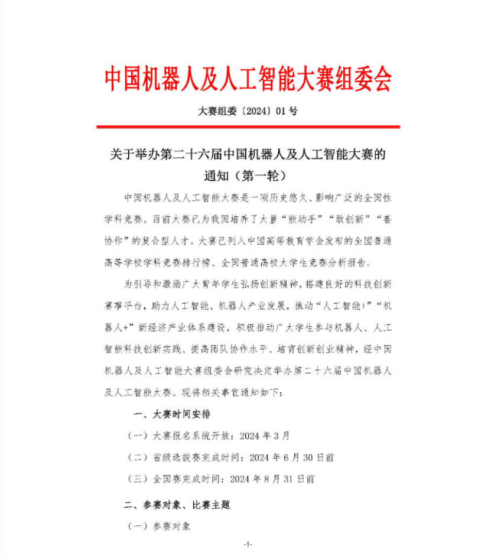
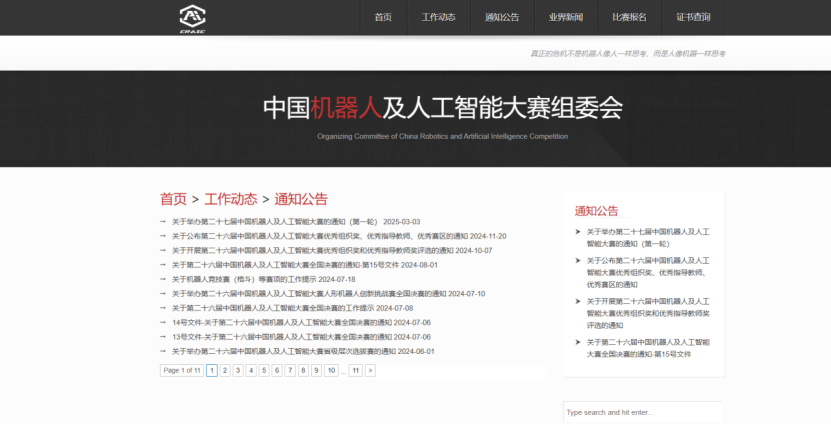
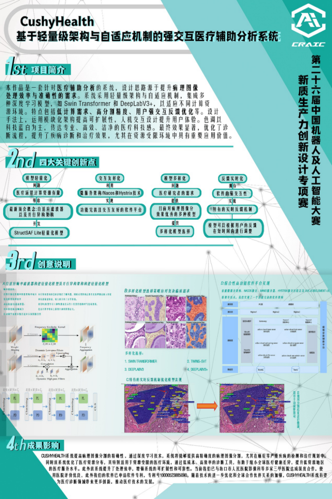

# 中国机器人及人工智能大赛

## 基本介绍

### 一句话概括
🌟 参赛队员需小于等于三人，鼓励学生设计新的人工智能及机器人相关项目，设计项目相关展板以及项目申报书，并通过 PPT 以及现场演示向评委展示项目相关内容的比赛。

---

## 地位
中国机器人及人工智能大赛是一项历史悠久、影响广泛的全国性学科竞赛。大赛已为我国培养了大量“能动手”“敢创新”“善协作”的复合型人才，并已列入中国高等教育学会发布的全国普通高等学校学科竞赛排行榜、全国普通高校大学生竞赛分析报告。  
比赛以培养学生解决实际问题为出发点，旨在培养学生理论与实践的融合能力和协作精神，实现多学科、多领域的有机结合，培养学生提出问题的能力，对培养高素质拔尖创新型人才具有重要意义，属于**A类**竞赛。

---

## 趋势
该竞赛由 1999 年开始举办，举办时间为每年的 4 月份到 8 月份。随着影响力不断拓展和含金量逐年提高，参赛学校和队伍数量整体呈现显著上升趋势。越来越多的企业投身其中、增设赛道，在提升自身知名度的同时，为学生提供了更多开发实践的平台和锻炼机会。当前，该赛事更新速度极快、成长迅速，正展现出朝气蓬勃的发展活力。

---

## 官网
该竞赛官网信息十分完整，包含比赛通知、比赛安排、比赛报名、赛事流程与获奖名单等内容，界面简单、交互方便。  

竞赛官网：[中国机器人及人工智能大赛官网](https://www.caairobot.com) 

---

## 时间线概览
- **4月**：赛事启动，官网发布参赛赛道以及大赛安排  
- **4-6月**：各赛区开启省赛，进行组队报名、填写报名表和项目申报书（包括参赛者与指导老师、赛道选择、作品简介、项目查新报告）  
- **5-6月**：各赛区进行线下比赛，评选赛区内奖项  
- **7月中到7月下旬**：各赛区推选入围决赛名单  
- **8月初**：公布入围决赛的队伍名单  
- **8月中旬**：全国总决赛  
- **8月下旬**：公布决赛获奖名单

---

## 参赛好处
- **保研助力**：对于有志于保研的同学，如果所在学院对该赛事的保研加分较为可观，参与竞赛获取保研分数是不失为一个良策。  
- **多元项目奠基**：参与此赛事可设计一个完整的项目，既能投身大创项目，又可参加其他项目设计类技术赛和商赛，甚至有机会发表论文，收获颇丰。  
- **简历增色**：该竞赛属于项目设计类，参赛经历能为个人简历增添一段完整的项目开发经历，使简历更具竞争力。  
- **实习与就业契机**：表现突出或极具潜力的队伍有机会借助竞赛获得相关企业的实习机会，甚至直接拿到工作 offer。  
- **项目素养提升**：参与竞赛需经历一个完整的项目周期，能显著提升对项目整体把控能力和项目意识。  
- **领导力培养**：作为项目负责人，需要带领团队进行项目设计，过程中自身的领导力也将得到充分锻炼。  
- **视野拓展**：通过参赛，参赛者可以参考他人项目成果并结合自身实践，在技术层面和思维广度上获得极大提升，这对本科生来说是不可或缺的重要素养。

---

## 难度分析
项目最终的名次会受到项目自身质量以及评委的主观因素影响。由于每个项目的实现难度存在差异，各位评委的评价标准也各不相同，这种不确定性使得难度难以量化。

总体来说，该竞赛的难度处于中等水平：
- 省赛中拿到省一等奖的比例约为 20%，省二等奖的比例约为 30%，而一等奖和二等奖基本都可入选决赛，获奖比例相对较高。

比赛的难度主要体现在以下几个方面：
1. **项目创新性**：要求参赛队伍具备创新思维，善于收集资料并开展头脑风暴。  
2. **项目功能性**：所设计的项目必须具备实用价值，因此需要做好充分的前期调研。  
3. **技术复杂性**：作为技术竞赛，考察队伍对赛题相关技术的运用能力及项目实现的难度。  
4. **综合表现力**：不仅要打造优秀项目，还需通过 PPT 演示等形式，将项目内容完整、清晰地呈现给评委。

排除老师指导或历届经验等外在因素，完全从零开始设计并开发一个项目大约需要四到六个月。如果项目立意良好、技术实现到位且展示出色，获奖的可能性会大大提高。  
同学们可直接在官网查看不同区域赛和国赛的获奖名单，名单中详细列出了各获奖队伍的作品名称及获奖情况。

---

## 适合专业
由于项目可能涵盖人工智能、物联网、嵌入式、软件开发、前后端开发等多个技术栈，因此适合计算机、自动化、物联网等相关工科背景的学生参加（具体视项目内容而定）。

---

## 推荐指数
✰✰✰✰（四颗星）

**优势：**  
获奖难度较低，参赛者较易取得成绩，尤其是在部分冷门赛道中更具优势。通过竞赛产出的项目成果具备极强的延展性，不仅可持续优化后用于其他竞赛，甚至有潜力转化为学术论文。全程深度参与竞赛，参赛者可接触到极为丰富的技术栈，有助于拓展专业知识广度，提升综合能力和实践水平。

**不足：**  
相比一些行业内广为人知的比赛，该竞赛在影响力方面存在一定差距，在吸引关注、资源和行业认可度等方面相对较弱。竞赛结果受比赛时机、举办地点等外部条件及团队协作默契等主观因素影响较大，对团队的团结协作和项目推进的稳定性提出较高要求。此外，整个项目周期较长，对团队的耐力、资源投入及持续推进能力均构成考验。

---

## 赛道剖析
新质生产力创新设计赛道只需提交一份作品展板，由评委依据展板进行打分。  
因此，除项目创新性外，展板设计尤为重要。建议找一个设计学院或擅长海报制作的同学（最好有相关比赛经验）协助设计展板。展板需重点展示作品内容及设计所用技术，突出作品的创新性和独特之处，并辅以精美插图，整体风格要求简洁且充满科技感。

